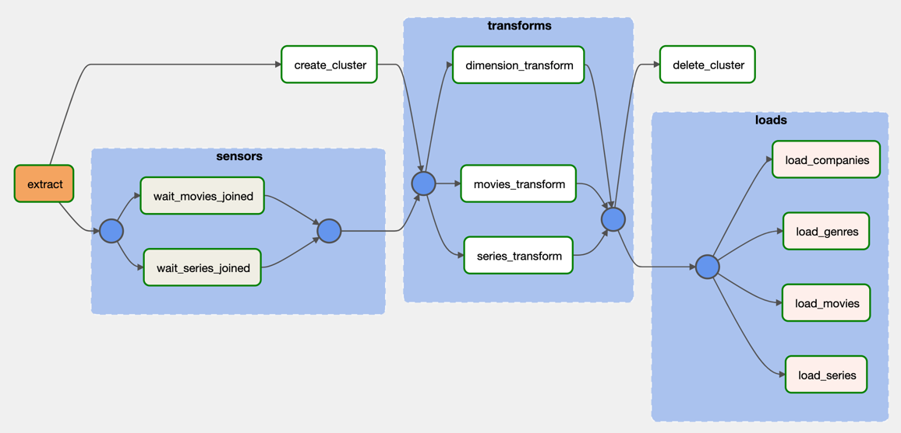
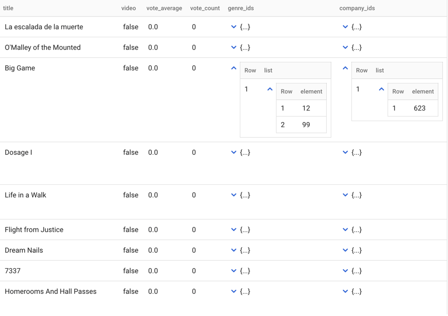
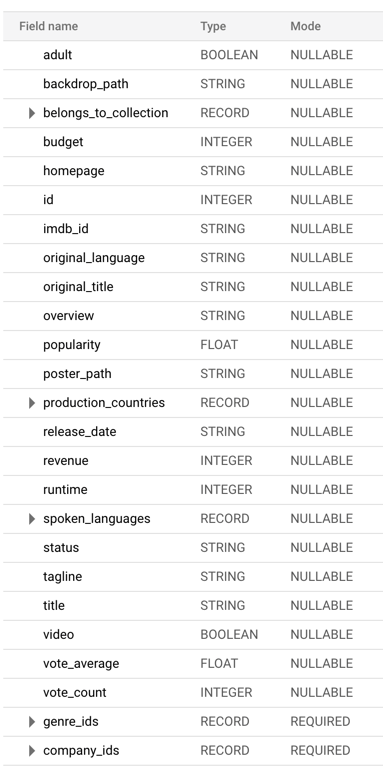

# TMDB ETL Pipeline datasets
 
In this repo I create ETL pipeline from 
[tmdb kaggle dataset](https://www.kaggle.com/edgartanaka1/tmdb-movies-and-series).
This datasets consists of a million movies and hundreds thousands of series reviews.

## Pipeline Overview
1. Extract data from kaggle dataset, and combine files into single one for each dataset.
Reference: [corresponding code](src/task/extract_and_combine)
2. Transform data from previous step to desired structure.
Please have a look to [corresponding notebook](src/notebook/tmdb.ipynb)
I recommend open it via Google Colab. Reference: [pipeline code](src/task/transform)
3. Load transformed data to BigQuery data warehouse.
Reference: [code L96-118](src/airflow_dag/dag.py)
4. Orchestrate all the task using Apache Airflow with the Dag shown below.
Reference: [airflow code](src/airflow_dag/dag.py)

## Data Warehouse
Below you can find some of the screenshot of data warehouse of `movies` table.
I decide to not denormalize field with `RECORD` type (which consists of array or struct)
to reduce join, which is more compute-intensive,
yet doesn't increase storage like if we denormalized it

